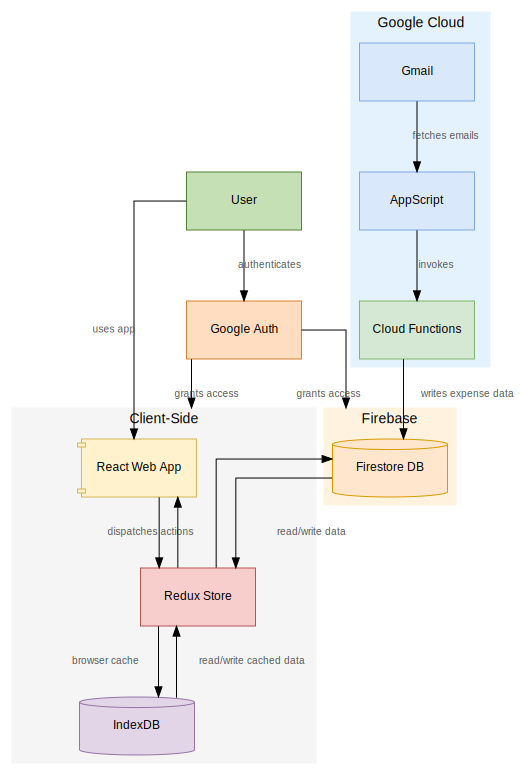

<div align="center">
  <br/>
  
  <br />
  <br />
  <strong>Track, Categorize, Analyze, and Master Your Personal Finances</strong>
</div>

<p align="center">
  <a href="#license">License</a> •
  <a href="#overview">Overview</a> •
  <a href="#features">Features</a> •
  <a href="#demo">Demo</a> •
  <a href="#technology-stack">Tech Stack</a> •
  <a href="#architecture">Architecture</a> •
  <a href="#project-structure">Project Structure</a> •
  <a href="#getting-started">Getting Started</a> •
  <a href="#Future Roadmap">Future Roadmap</a> •
  <a href="#support-by-donating">Support by Donating</a> 
</p>

---

## License

This project is licensed under the [GNU General Public License v3.0](LICENSE).

> **Disclaimer:** Currently, PennyFox only supports transaction tracking for below
> * HDFC UPI - credit & debit transactions.
> * HDFC Credit card - only debit transactions.
>
> We are actively working on expanding support to other banks email and transaction types.

## Overview

PennyFox is a comprehensive, open-source web application designed to empower individuals in managing their personal finances. It provides an intuitive platform to track, categorize, and visualize expenses, helping users gain clear insights into their spending patterns and achieve financial mastery. Built with modern web technologies, PennyFox offers a user-friendly experience with robust features, including offline support and secure authentication.

## Features

* 📊 **Expense Tracking**: Easily add, edit, and manage your daily expenses with detailed inputs.
* 🏷️ **Tagging System**: Categorize expenses with custom tags for flexible and granular organization.
* 📅 **Date Filtering**: Filter expenses by various time periods (e.g., 1 day, 7 days, 2 weeks, custom ranges) for focused analysis.
* 📊 **Visualization**: Understand spending patterns at a glance through interactive statistical charts and graphs.
* 🔄 **Offline Support**: Access and manage your data even without an internet connection, thanks to IndexedDB for local storage.
* 🔒 **Google Authentication**: Secure and convenient login via Google OAuth for user management.
* 📧 **Gmail Integration**: Effortlessly scan your emails to automatically identify and import expense information.

## Demo

[Live Demo](#) - Coming Soon!


## Technology Stack

PennyFox leverages a modern and robust set of technologies to deliver a user friendly and maintainable application.

### Frontend
* **UI Framework**: [React](https://reactjs.org/)
* **Type Safety**: [TypeScript](https://www.typescriptlang.org/)
* **Component Library**: [Material-UI v6](https://mui.com/)
* **Animations**: [Framer Motion](https://www.framer.com/motion/)
* **Charts**: [Recharts](https://recharts.org/en-US/)

### State Management
* **Centralized State**: [Redux Toolkit](https://redux-toolkit.js.org/)

### Data Storage
* **Cloud Database**: [Firebase Firestore](https://firebase.google.com/docs/firestore)
* **Offline Storage**: [IndexedDB](https://developer.mozilla.org/en-US/docs/Web/API/IndexedDB_API) (via [idb](https://www.npmjs.com/package/idb) library)

### Authentication
* **OAuth Provider**: [Google OAuth](https://developers.google.com/identity/protocols/oauth2) (integrated using [@react-oauth/google](https://www.npmjs.com/package/@react-oauth/google))

### Utilities
* **Date Manipulation**: [dayjs](https://day.js.org/)
* **HTTP Client**: [axios](https://axios-http.com/)


## Project Structure

```
pennyfox/
├── public/               # Static assets
├── src/
│   ├── api/              # API clients and data fetching
│   │   ├── ExpenseAPI.ts
│   │   └── FinanceIndexDB.ts
│   ├── components/       # Reusable UI components
│   ├── firebase/         # Firebase configuration & utilities
│   ├── hooks/            # Custom React hooks
│   ├── pages/            # Application pages & views
│   │   ├── home/         # Expense dashboard
│   │   ├── login/        # Authentication flow
│   │   ├── setting/      # Application settings
│   │   └── insights/     # Insights views
│   ├── store/            # Redux store configuration
│   └── utility/          # Helper functions & constants
├── functions/            # Firebase Cloud Functions
└── appScript/            # Google Apps Script for email integration
```

## Architecture

PennyFox is built using a modern front-end architecture with the following key components:


### Overview

1. **User Authentication**: Users authenticate using Google OAuth
2. **Data Fetching**:
   - On app initialization, data is fetched from Firebase Firestore
   - Data is stored locally in IndexedDB for offline access
   - Redux store is populated with expense and tag data
3. **User Interactions**:
   - Users can view, filter, and group expenses
   - New expenses can be added manually or imported
   - Expenses can be tagged for categorization
4. **Data Persistence**:
   - Changes are saved to both IndexedDB and Firebase
   - Data synchronization happens automatically when online

### Architecture Diagram


## Getting Started

For detailed setup instructions, please refer to our [Setup Instructions](./public/docs/setup.md)


## Future Roadmap

- [ ] Multiple bank support (We need people to help us with this)
- [ ] Enahncing Insights with more detailed analytics
- [ ] Expense predictions using historical data (Firebase AI Logic)
- [ ] Expense sharing/tracking between users (Multi user persona)

## Contributing

Contributions are welcome! Please feel free to submit a Pull Request.

1. Fork the repository
2. Create your feature branch (`git checkout -b feature/amazing-feature`)
3. Commit your changes (`git commit -m 'Add some amazing feature'`)
4. Push to the branch (`git push origin feature/amazing-feature`)
5. Open a Pull Request to main branch

Please ensure your code follows the project's and general coding standards.


## Support by Donating
<a href="https://www.buymeacoffee.com/arcticfoxrc"></a>
