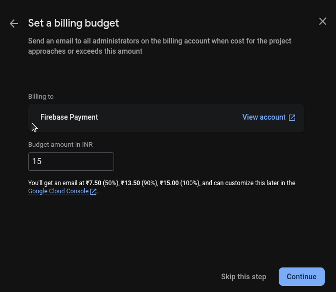

# PennyWise Setup for Linux

This guide will walk you through setting up the Arctic Fox project on a Linux environment.

## Prerequisites

- **Firebase Blaze Plan**: To use this project, you'll need to enable the Firebase "Blaze" (pay-as-you-go) plan. This
  requires adding a billing account to your Firebase project, for which a credit card is mandatory.

> **Note:** I have been using this project for tracking my expenses for the last 2 years, and I have rarely crossed the
> free tier limits. On a few occasions, I was billed ₹1-2 when I was testing Firestore with a high volume of requests.
> However, you can set up a billing budget to receive reminder emails, which helps ensure you stay within your desired
> spending limits.

## Minimum Technical Requirements

Before you begin, please ensure you have the following minimum versions installed on your system:

- **Node.js:** `v20.0.0` or higher
- **npm:** `v10.0.0` or higher

### Installing Node.js and npm

Here’s how you can install Node.js and npm on different operating systems. We recommend using a version manager like
`nvm` or `nvs` to make it easy to switch between Node.js versions.

<details>
<summary>Linux (using nvm)</summary>

1. **Install nvm (Node Version Manager):**
   Open your terminal and run the following command to install `nvm`:
   ```bash
   curl -o- https://raw.githubusercontent.com/nvm-sh/nvm/v0.39.3/install.sh | bash
   ```
   After the installation, restart your terminal or run `source ~/.bashrc` (or `~/.zshrc`) to apply the changes.

2. **Install Node.js:**
   Now, you can install the latest LTS version of Node.js with:
   ```bash
   nvm install --lts
   nvm use --lts
   ```
   This will also install the corresponding version of `npm`.

3. **Verify the Installation:**
   Run the following commands to ensure everything is set up correctly:
   ```bash
   node -v
   npm -v
   ```

</details>

<details>
<summary>Windows (using the official installer)</summary>

1. **Download the Installer:**
   Go to the [official Node.js website](https://nodejs.org/en/download/) and download the Windows Installer (`.msi`) for
   the LTS version.

2. **Run the Installer:**
    - Double-click the downloaded `.msi` file.
    - Follow the prompts in the setup wizard. Make sure to select the option to install **"Tools for Native Modules"**
      if you plan to work with packages that require compilation.
    - The installer will automatically add `node` and `npm` to your system's PATH.

3. **Verify the Installation:**
   Open a new Command Prompt or PowerShell window and run:
   ```bash
   node -v
   npm -v
   ```

</details>

<details>
<summary>macOS (using Homebrew)</summary>

1. **Install Homebrew (if not already installed):**
   Open your terminal and run the following command to install Homebrew:
   ```bash
   /bin/bash -c "$(curl -fsSL https://raw.githubusercontent.com/Homebrew/install/HEAD/install.sh)"
   ```

2. **Install Node.js:**
   Once Homebrew is installed, you can install Node.js with a single command:
   ```bash
   brew install node
   ```
   This will install the latest version of Node.js and `npm`.

3. **Verify the Installation:**
   Run the following commands to ensure everything is set up correctly:
   ```bash
   node -v
   npm -v
   ```

</details>

## Getting Started

### Firebase Setup

1. **Navigate to the Firebase Console:**
   Open your web browser and go to [https://console.firebase.google.com/](https://console.firebase.google.com/).

2. **Create a New Firebase Project:**
    - Click on **"Add project"** to start the setup process.
    - Enter a unique name for your project (e.g., `pennywise-2a`).
    - Uncheck **"Enable Google Analytics for this project"** and click **"Create project"**.

3. **Access Your Project Dashboard:**
   Once the project is created, you will be redirected to the project's dashboard.


4. **Upgrade to the Blaze Plan:**
    - By default, your project will be on the "Spark" plan. To enable all features required for PennyWise, you must
      upgrade to the "Blaze" (pay-as-you-go) plan.
    - In the bottom-left corner of the navigation menu, click on the **"Upgrade"** button.
    - Select the **Blaze plan** and follow the prompts to create a Cloud Billing account. This will require a credit
      card for verification, which may involve a small transaction (e.g., 2 rupees).

5. **Set a Billing Budget:**
    - After setting up your billing account, you will be prompted to create a budget. It is highly recommended to set a
      budget to prevent unexpected charges.
    - For example, you can set a monthly budget of ₹15.
    - Once your budget is set, link the Cloud Billing account to your project.



### Install Firebase CLI

To interact with Firebase services from your terminal, you need to install the Firebase CLI.

- **Install Firebase CLI:**
  Open your terminal and run the following command:
    ```bash
    npm install -g firebase-tools @google/clasp
    ```

### AppScript Setup

1. **Login to AppScript:**
   Visit the [Google Apps Script](https://script.google.com/) website and log in with your Google account.
   Go to settings > Google Apps Script API > Enable the option
   This is necessary to create and manage your Apps Script projects.

   


2. **Login via clasp:**
   In your terminal, run:
   ```bash
   clasp login
   ```
   This will open a browser window for you to log in with your Google account. Select all for the permissions requested.


3. **Go to the appScript directory:**
   Navigate to the `appScript` directory in your project:
   ```bash
   cd appScript
   ```
4. **Delete existing clasp files:**
   If you have an existing `.clasp.json` file, delete it to avoid conflicts:
   ```bash
   rm .clasp.json
   ```

5. **Create the AppScript Project:**
   In your terminal, navigate to the directory where you want to clone the AppScript project and run:
    ```bash
    clasp create --title "Pennywise App Script" --type standalone
    ```
6. **Push the Local Code to AppScript:**
   After creating the project, you can push your local code to the Apps Script project:
    ```bash
    clasp push
    ```
7. **Deploy the AppScript Project:**
   To deploy your Apps Script project, run:
    ```bash
    clasp deploy --description "pennywise v1"
    ```
   This will create a new deployment of your Apps Script project. you will output like below:
   ```
   Deployed AKfycbwKWtD4RpPUoUZuW4eF-l3-gUSxCmI95LFDD6Lea1KqgH0qZjfq-e-0C4u9bfcymLpztw @1
   ```
   note down the deployment ID (the part after `Deployed`), as you will need it later for future updates & deployments.

   ** for future deployments, you can use the command below to update the existing deployment
   ```bash
   clasp deploy --deploymentId <DEPLOYMENT_ID_FROM_PREVIOUS_CMD> --description "pennywise v2"
    ```
   