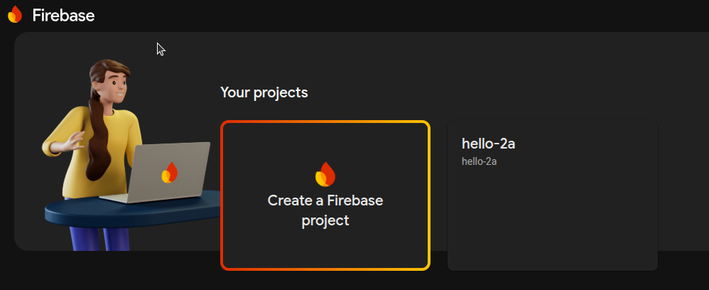

# PennyFox Setup for Linux

This guide will walk you through setting up the Arctic Fox project on a Linux environment.

## Prerequisites

- **Firebase Blaze Plan**: To use this project, you'll need to enable the Firebase "Blaze" (pay-as-you-go) plan. This
  requires adding a billing account to your Firebase project, for which a credit card is mandatory.

> **Note:** I have been using this project for tracking my expenses for the last 2 years, and I have rarely crossed the
> free tier limits. Occasionally, I was billed ₹1-2 when I was testing Firestore with a high volume of requests.
> However, you can set up a billing budget to receive reminder emails, which helps ensure you stay within your desired
> spending limits.

## Minimum Technical Requirements

Before you begin, please ensure you have the following minimum versions installed on your system:

- **Node.js:** `v20.0.0` or higher
- **npm:** `v10.0.0` or higher

### Installing Node.js and npm

Here’s how you can install Node.js and npm on different operating systems. We recommend using a version manager like
`nvm` or `nvs` to make it easy to switch between Node.js versions.

<details>
<summary>Linux (using nvm)</summary>

1. **Install nvm (Node Version Manager):**
   Open your terminal and run the following command to install `nvm`:
   ```bash
   curl -o- https://raw.githubusercontent.com/nvm-sh/nvm/v0.39.3/install.sh | bash
   ```
   After the installation, restart your terminal or run `source ~/.bashrc` (or `~/.zshrc`) to apply the changes.

2. **Install Node.js:**
   Now, you can install the latest LTS version of Node.js with:
   ```bash
   nvm install --lts
   nvm use --lts
   ```
   This will also install the corresponding version of `npm`.

3. **Verify the Installation:**
   Run the following commands to ensure everything is set up correctly:
   ```bash
   node -v
   npm -v
   ```

</details>

<details>
<summary>Windows (using the official installer)</summary>

1. **Download the Installer:**
   Go to the [official Node.js website](https://nodejs.org/en/download/) and download the Windows Installer (`.msi`) for
   the LTS version.

2. **Run the Installer:**
    - Double-click the downloaded `.msi` file.
    - Follow the prompts in the setup wizard. Make sure to select the option to install **"Tools for Native Modules"**
      if you plan to work with packages that require compilation.
    - The installer will automatically add `node` and `npm` to your system's PATH.

3. **Verify the Installation:**
   Open a new Command Prompt or PowerShell window and run:
   ```bash
   node -v
   npm -v
   ```

</details>

<details>
<summary>macOS (using Homebrew)</summary>

1. **Install Homebrew (if not already installed):**
   Open your terminal and run the following command to install Homebrew:
   ```bash
   /bin/bash -c "$(curl -fsSL https://raw.githubusercontent.com/Homebrew/install/HEAD/install.sh)"
   ```

2. **Install Node.js:**
   Once Homebrew is installed, you can install Node.js with a single command:
   ```bash
   brew install node
   ```
   This will install the latest version of Node.js and `npm`.

3. **Verify the Installation:**
   Run the following commands to ensure everything is set up correctly:
   ```bash
   node -v
   npm -v
   ```

</details>

### Cloning the Project

You can get the project files either by cloning the repository using Git or by downloading the source code as a ZIP file.

- **With Git:**
  ```bash
  git clone https://github.com/your-username/penny-wise.git
  ```
- **Direct Download:**
  Alternatively, you can download the project as a ZIP file from the repository's main page and extract it.

After cloning or extracting the project, you need to open a terminal and navigate to the project's root directory.

<details>
<summary>Windows</summary>

1.  **Open Terminal:** Right-click the Start button and select **Windows PowerShell** or **Command Prompt**.
2.  **Navigate to Directory:** Use the `cd` command. For example, if the project is in your `Downloads` folder, run:
    ```cmd
    cd C:\\Users\\YourUsername\\Downloads\\penny-wise
    ```

</details>

<details>
<summary>macOS</summary>

1.  **Open Terminal:** Find the Terminal app in `Applications/Utilities` or search for it with Spotlight (`Cmd+Space`).
2.  **Navigate to Directory:** Use the `cd` command. For example:
    ```bash
    cd ~/Downloads/penny-wise
    ```

</details>

<details>
<summary>Linux</summary>

1.  **Open Terminal:** Press `Ctrl+Alt+T` or search for "Terminal" in your applications menu.
2.  **Navigate to Directory:** Use the `cd` command. For example:
    ```bash
    cd ~/Downloads/penny-wise
    ```

</details>

## Getting Started

### Firebase Setup

1. **Navigate to the Firebase Console:**
   Open your web browser and go to [https://console.firebase.google.com/](https://console.firebase.google.com/).

2. **Create a New Firebase Project:**
    - Click on **"Add project"** to start the setup process.
    - Enter a unique name for your project, this will be your project-id (e.g., `pennyfox-2a`).
    - Uncheck **"Enable Google Analytics for this project"** and click **"Create project"**.

3. **Access Your Project Dashboard:**
   Once the project is created, you will be redirected to the project's dashboard.



4. **Upgrade to the Blaze Plan:**
    - By default, your project will be on the "Spark" plan. To enable all features required for PennyFox, you must
      upgrade to the "Blaze" (pay-as-you-go) plan.
    - In the bottom-left corner of the navigation menu, click on the **"Upgrade"** button.
    - Select the **Blaze plan** and follow the prompts to create a Cloud Billing account. This will require a credit
      card for verification, which may involve a small transaction (e.g., 2 rupees).

5. **Set a Billing Budget:**
    - After setting up your billing account, you will be prompted to create a budget. It is highly recommended to set a
      budget to prevent unexpected charges.
    - For example, you can set a monthly budget of ₹15.
    - Once your budget is set, link the Cloud Billing account to your project.


6. **Enable Web App Configuration:**

  - In the Firebase console, click on the **"+ Add app"** then web app icon to add a web app to your project.
    


    
  - click on web icon to add a web app to your project.


  - Enter a nickname for your app (e.g., `pennyfox-2a`) and don't check the box to set up Firebase Hosting
  - Click **"Register app"**.


  - After registering your app, you will see a configuration snippet. 
  - Copy this snippet highlighted in blue in below screenshot.


- Paste content in the file `src/firebase/firebase-public.ts` & keep `export` word as it is.
- This snippet contains your Firebase project's configuration details, which are essential for connecting your app to Firebase services.
  paste `const firebaseConfig = { ... }` in file after the word `export `.


### Install Firebase CLI

To interact with Firebase services from your terminal, you need to install the Firebase CLI.

- **Install Firebase CLI:**
  Open your terminal and run the following command:
    ```bash
    npm install -g firebase-tools @google/clasp
    ```

### Firestore Setup


  - **Enable Firestore Rules:**
    - Replace `firebase.rules` with the following rules to restrict access to your email,
    - replace `your-email@gmail.com` with your actual email address.
      ```txt
      rules_version = '2';

      service cloud.firestore {
      match /databases/{database}/documents {
    
          function isMyEmail() {
            // It's good practice to also check email_verified for stronger security
            return request.auth.token.email == "your-email@gmail.com" && request.auth.token.email_verified == true;
          }
    
          // This single rule applies to ALL documents in the database
          // and grants read/write access ONLY if the user is authenticated
          // and their email matches "your-email@gmail.com" AND it's verified.
          match /{document=**} {
            allow read, write: if request.auth != null && isMyEmail();
          }
      }
        ```

-  **Initialize Firestore:**
    ```bash
   firebase deploy --only firestore
   ```
-  **Deploy Functions & Web Hosting:** you can deploy them with
      ```bash
      firebase deploy
      ```
   
### AppScript Setup

1. **Update Function URL:**
   - Open the file `appScript/expenses.js`.
   - Replace the `PROJECT_ID` with the project-id.
   - This URL is typically in the format: `https://<region>-<project-id>.cloudfunctions.net/<function-name>`.
   

2. **Log in with `clasp`:**
    Run the following command to authorize `clasp` with your Google account:
    ```bash
    clasp login
    ```
    This will open a browser window. Log in to your Google account and grant the requested permissions.

3. **Navigate to the `appScript` Directory:**
    Change your current directory to the `appScript` folder within the project:
    ```bash
    cd appScript
    ```

4. **Create a New Apps Script Project:**
    Run the following command to create a new, standalone Apps Script project:
    ```bash
    clasp create --title "Pennyfox App Script" --type standalone
    ```

5. **Push Local Code to Apps Script:**
    To upload your local code to the newly created Apps Script project, run:
    ```bash
    clasp push
    ```

6. **Deploy the Project:**
    Deploy your project with the following command, adding a description for the version:
    ```bash
    clasp deploy --description "pennyfox v1"
    ```
    You will see output similar to this:
    ```
    Deployed AKfycbwKWtD4RpPUoUZuW4eF-l3-gUSxCmI95LFDD6Lea1KqgH0qZjfq-e-0C4u9bfcymLpztw @1
    ```
    Copy the **Deployment ID** from the output, as you will need it for future updates.

    > **Future Deployments:**
    > To update an existing deployment, use the following command with your deployment ID:
    > in above output, `AKfycbwKWtD4RpPUoUZuW4eF-l3-gUSxCmI95LFDD6Lea1KqgH0qZjfq-e-0C4u9bfcymLpztw` is the deployment ID.
    > ```bash
    > clasp deploy --deploymentId <YOUR_DEPLOYMENT_ID> --description "pennyfox v2"
    > ```
